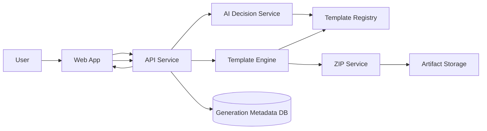

# FolderAssi Architecture

## 1. Purpose

FolderAssi converts natural-language requirements into a deterministic project scaffold.

The product goal is not code generation. The product goal is accurate structure generation from approved templates.

## 2. Design principles

1. Deterministic generation over free-form AI output
2. Template registry is the single source of truth
3. AI is a classifier and parameter extractor, not a renderer
4. Every generation is schema-validated before files are created
5. Preview and confirmation happen before ZIP export whenever confidence is low or required fields are missing
6. Template versions are immutable for reproducibility

## 3. Non-goals

- Generating arbitrary folders from raw AI text
- Letting AI invent files outside approved templates
- Letting templates execute unrestricted code
- Using prompt output as file system instructions

## 4. System overview

FolderAssi is organized as a small monorepo with five major runtime responsibilities:

1. Web App
2. API Service
3. AI Decision Service
4. Template Engine
5. Artifact and ZIP Service



## 5. High-level modules

### 5.1 Web App

Responsibilities:

- Accept project requirements in natural language
- Show detected template, variables, options, and confidence
- Collect missing required fields
- Preview the generated file tree before build
- Trigger generation and download ZIP
- Show generation history and errors

Recommended role:

- Presentation and orchestration UI only
- No direct file-system generation logic

Suggested app pages:

- `/`
- `/analyze`
- `/preview/:generationId`
- `/downloads/:artifactId`
- `/templates`

### 5.2 API Service

Responsibilities:

- Accept user requests
- Load template metadata
- Call AI Decision Service with structured constraints
- Validate AI output
- Start generation jobs
- Persist generation records
- Expose download endpoints

Suggested API endpoints:

- `POST /api/analyze`
- `POST /api/generate`
- `GET /api/generations/:id`
- `GET /api/generations/:id/tree`
- `GET /api/generations/:id/download`
- `GET /api/templates`
- `GET /api/templates/:id`

### 5.3 AI Decision Service

Responsibilities:

- Read the user requirement
- Compare it against template metadata only
- Return:
  - `templateId`
  - `variables`
  - `options`
  - `confidence`
  - `missingFields`
  - `reasoningSummary`

Strict boundaries:

- Cannot emit file trees
- Cannot emit file contents
- Cannot emit paths or create custom templates
- Must return JSON that matches a server-side schema

Model contract:

```json
{
  "templateId": "nextjs-saas-basic",
  "variables": {
    "projectName": "Acme Dashboard",
    "packageManager": "pnpm"
  },
  "options": {
    "includeAuth": true,
    "includeDocker": false
  },
  "confidence": 0.92,
  "missingFields": [],
  "reasoningSummary": "Matched SaaS dashboard template with authentication."
}
```

### 5.4 Template Registry

Responsibilities:

- Store all approved JSON templates
- Store template metadata used for AI selection
- Version templates
- Expose template schemas for validation and UI form rendering

Recommended structure:

```text
templates/
  spring-boot-layered-api-starter.json
  aspnetcore-webapi-starter.json
  react-feature-based-starter.json
```

Important rule:

The AI should primarily see template metadata, variable schema, option schema, tags, examples, and constraints. Full file content should not be needed for template selection.

### 5.5 Template Engine

Responsibilities:

- Resolve a template by `templateId`
- Validate `variables` and `options`
- Render directories and files deterministically
- Enforce safe paths
- Produce a manifest of generated outputs

Engine rules:

1. No path traversal outside the workspace
2. No write operation before schema validation succeeds
3. No unknown variables unless explicitly allowed by template schema
4. Template rendering is deterministic from the same inputs
5. Output manifest is produced for preview and audit

### 5.6 ZIP Service

Responsibilities:

- Build a temporary generation workspace
- Archive generated content into ZIP
- Store or stream the ZIP artifact
- Clean up expired temporary directories

## 6. Recommended monorepo layout

```text
FolderAssi/
  apps/
    web/                  # Frontend
    api/                  # Backend API
  packages/
    ai-decision/          # Prompting, structured-output handling
    shared-types/         # Shared DTOs and schemas
    template-engine/      # Deterministic renderer
    template-registry/    # Template loading, indexing, validation
    zip-service/          # Archive creation and artifact lifecycle
  templates/              # Approved scaffold templates
  docs/                   # Architecture and specs
```

## 7. Core request flow

### 7.1 Analyze phase

1. User submits requirement text.
2. API loads template catalog summaries from Template Registry.
3. API sends:
   - user requirement
   - template summaries
   - output JSON schema
4. AI returns `templateId`, `variables`, `options`, `confidence`, and `missingFields`.
5. API validates the response.
6. Web App shows the suggested template and missing inputs.

### 7.2 Preview phase

1. User confirms or edits inputs.
2. API asks Template Engine for a dry-run manifest.
3. Template Engine resolves the template and returns:
   - folder tree
   - file manifest
   - validation errors, if any
4. Web App shows a preview before final generation.

### 7.3 Generate phase

1. User confirms generation.
2. API creates a generation job.
3. Template Engine writes files into a temporary workspace.
4. ZIP Service archives the workspace.
5. API stores artifact metadata and exposes a download URL.

## 8. Data model

### 8.1 Template metadata

Used by AI for selection.

```json
{
  "id": "nextjs-saas-basic",
  "version": "1.0.0",
  "name": "Next.js SaaS Basic",
  "description": "Dashboard-style SaaS starter",
  "tags": ["web", "saas", "dashboard", "nextjs"],
  "variablesSchema": {},
  "optionsSchema": {},
  "examples": [
    "Build a SaaS dashboard with login",
    "Create a multi-page admin panel"
  ]
}
```

### 8.2 Generation request

```json
{
  "prompt": "Create a SaaS dashboard with auth and Docker support.",
  "templateId": "nextjs-saas-basic",
  "variables": {
    "projectName": "acme-dashboard"
  },
  "options": {
    "includeAuth": true,
    "includeDocker": true
  }
}
```

### 8.3 Generation record

```json
{
  "id": "gen_123",
  "templateId": "nextjs-saas-basic",
  "templateVersion": "1.0.0",
  "status": "completed",
  "manifestPath": "artifacts/gen_123/manifest.json",
  "zipPath": "artifacts/gen_123/project.zip",
  "createdAt": "2026-04-13T00:00:00.000Z"
}
```

## 9. Template selection contract

To preserve the product boundary, the AI selection system should receive only:

- user requirement text
- template summaries
- variable schema
- option schema
- example use cases
- business rules

It should not receive:

- file contents
- folder trees as editable instructions
- generation engine internals
- permission to author new templates

## 10. Validation pipeline

Validation should happen in four layers:

1. Request validation
2. AI output schema validation
3. Template schema validation
4. Rendered path safety validation

Recommended validators:

- JSON Schema or Zod for request and output payloads
- Template manifest validator inside `template-registry`
- Safe path resolver inside `template-engine`

## 11. Error handling strategy

Expected failure classes:

- No matching template
- Low confidence match
- Missing required variables
- Invalid option combination
- Template schema mismatch
- Render failure
- ZIP creation failure

User-facing behavior:

- If no confident template match exists, show top template candidates and ask for confirmation
- If required variables are missing, render a structured form
- If rendering fails, expose a human-readable error and internal trace id

## 12. Storage strategy

Recommended default:

- Template files: repository file system
- Generation metadata: SQLite for local development, PostgreSQL for production
- ZIP artifacts: local disk in development, object storage in production

## 13. Security and safety

1. Block `../` and absolute path escapes in templates
2. Sanitize interpolated file and folder names
3. Restrict helper functions to a fixed allowlist
4. Never execute arbitrary user code during generation
5. Log every generation with template version and inputs
6. Expire temporary build directories and ZIP URLs

## 14. Suggested implementation stack

Recommended pragmatic stack:

- Frontend: Next.js + React + TypeScript
- API: Fastify + TypeScript
- Shared validation: Zod
- Template engine: custom TypeScript package
- Archive creation: Node ZIP library
- Storage: SQLite locally, PostgreSQL and object storage later

Why this stack:

- Strong TypeScript support across UI, API, and engine
- Easy JSON and schema handling
- Good local development experience
- Clear path from monolith-style MVP to modular production deployment

## 15. MVP milestones

### Milestone 1

- Template registry loader
- One or two sample templates
- Analyze endpoint with structured AI output
- Dry-run preview tree

### Milestone 2

- Deterministic renderer
- ZIP generation
- Download flow
- Basic generation history

### Milestone 3

- More templates
- Template author tooling
- Confidence-based fallback UX
- Production storage adapters

## 16. Key architectural decision

The most important decision in FolderAssi is this:

AI chooses from a controlled library.
The engine builds from a controlled definition.

That separation is what keeps the product reliable, explainable, and reproducible.
